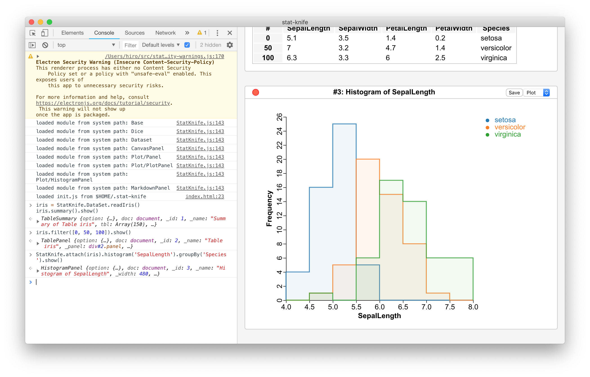

# StatKnife - A Convenient Knife for Statistical Operations

Copyright 2019- Tatsuhiro Aoshima (hiro4bbh@gmail.com).

## Introduction

StatKnife is a convenient knife for statistical operations.
It will also provide many features supported by modern Web browsers in many development environments.

## Features

- Interactive JavaScript (ES6) console on [Electron](https://electronjs.org/).
- Simple panel manager for summaries or plots
- Load the user configuration script at `$HOME/.StatKnife/init.js`

## Showcases

```js
iris = StatKnife.DataSet.readIris()
iris.summary().show()
iris.filter([0, 50, 100]).show()
StatKnife.attach(iris).histogram('SepalLength').groupBy('Species').show()
StatKnife.attach(iris).plot('SepalWidth', 'SepalLength').groupBy('Species').show()
```





```js
dice = new StatKnife.Dice(20190216)
sampleNorm = Array(100000).fill(0.0).map((_, i) => dice.uniformDist()())
StatKnife.attach(sampleNorm).histogram('value').thresholds(100).show()
```


## Installation and Development

The latest macOS is recommended for installing and developing StatKnife.

### Preparation

Install [node.js](https://nodejs.org/), then install [Electron](https://electronjs.org/) globally in your terminal as follows:

```
$ npm -g install electron
```

### Install StatKnife

Download StatKnife in your terminal as follows:

```
$ git clone https://github.com/hiro4bbh/StatKnife
```

Then, install the packages depended on by StatKnife at the root of StatKnife as follows:

```
$ npm install
```

### Use and Develop StatKnife

Start StatKnife at the root of StatKnife in your terminal as follows:

```
$ electron .
```

[Visual Studio Code](https://code.visualstudio.com/) (VSCode) is recommended for developing StatKnife.
VSCode provides a compact and fast development environment, including the terminal!

## TODO

- Prepare documentations.
- Write unit tests.
- Prepare StatKnife logo.
- Implement more statistical functions.
- Tweak visual styles and plot options.
- Prepare release packages.