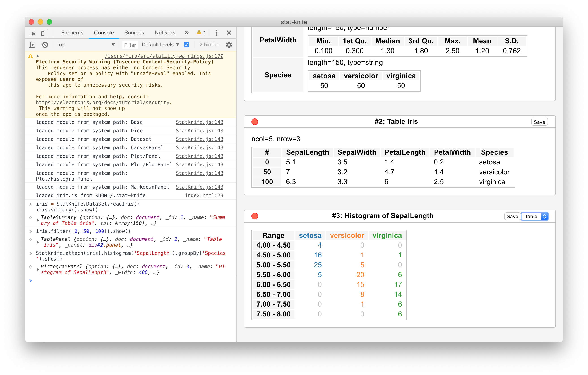
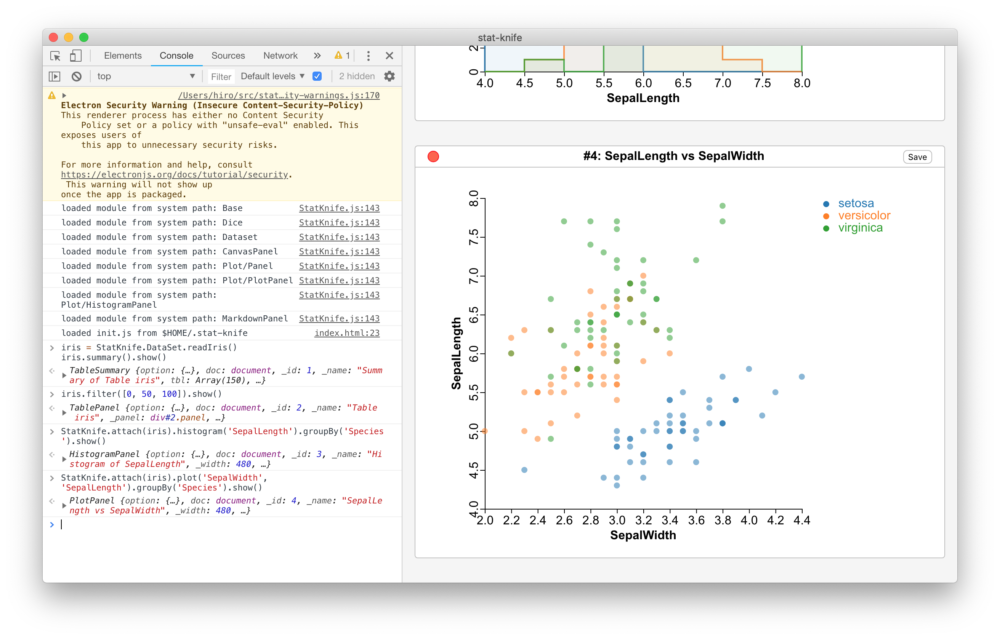
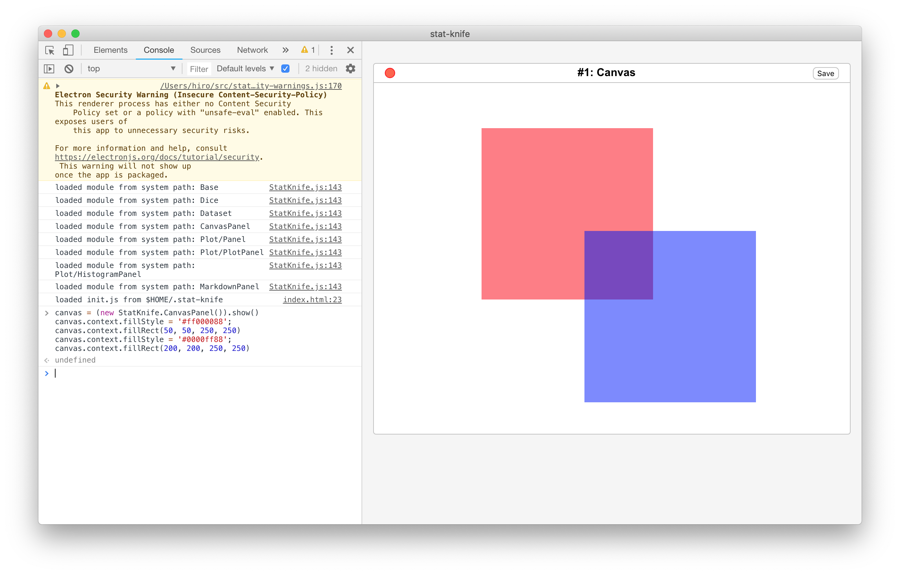
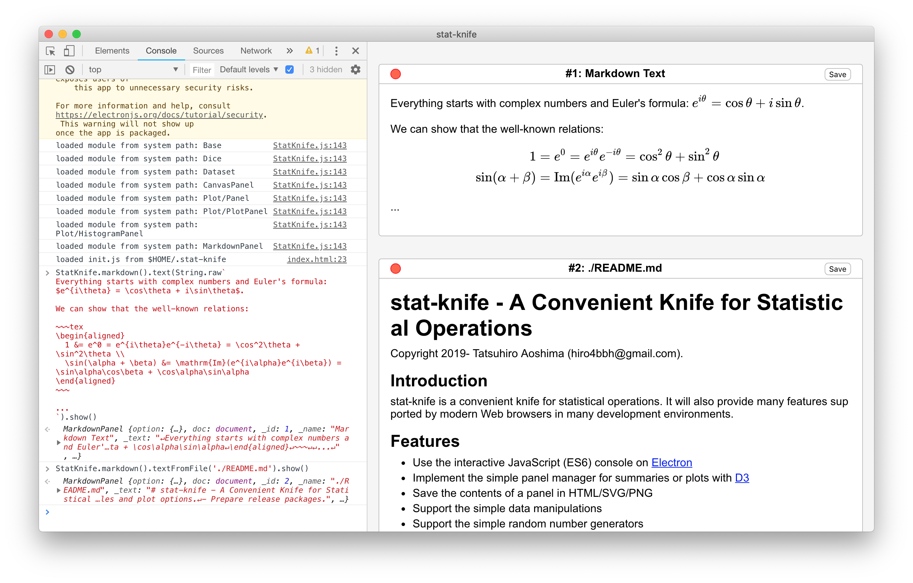

# stat-knife - A Convenient Knife for Statistical Operations

Copyright 2019- Tatsuhiro Aoshima (hiro4bbh@gmail.com).

## Introduction

stat-knife is a convenient knife for statistical operations.
It will also provide many features supported by modern Web browsers in many development environments.

## Features

- Use the interactive JavaScript (ES6) console on [Electron](https://electronjs.org/)
- Implement the simple panel manager for summaries or plots with [D3](https://d3js.org/)
- Save the contents of a panel in HTML/SVG/PNG
- Support the simple data manipulations
- Support the simple random number generators
- Support the markdown rendering with [markdown-it](https://markdown-it.github.io/) and the LaTeX rendering with [KaTeX](https://katex.org/)
- Load the user configuration script at `$HOME/.stat-knife/init.js`

## Showcases

```js
iris = StatKnife.DataSet.readIris()
iris.summary().show()
iris.filter([0, 50, 100]).show()
StatKnife.attach(iris).histogram('SepalLength').groupBy('Species').show()
StatKnife.attach(iris).plot('SepalWidth', 'SepalLength').groupBy('Species').show()
```





```js
dice = new StatKnife.Dice(20190216)
sampleNorm = Array(100000).fill(0.0).map((_, i) => dice.uniformDist()())
sampleNorm.summary().show()
StatKnife.attach(sampleNorm).histogram('value').thresholds(100).show()
```


```js
canvas = (new StatKnife.CanvasPanel()).show()
canvas.context.fillStyle = '#ff000088'; canvas.context.fillRect(50, 50, 250, 250)
canvas.context.fillStyle = '#0000ff88'; canvas.context.fillRect(200, 200, 250, 250)
```



```js
StatKnife.markdown().text(String.raw`
Everything starts with complex numbers and Euler's formula: $e^{i\theta} = \cos\theta + i\sin\theta$.

We can show that the well-known relations:

~~~katex
  1 = e^0 = e^{i\theta}e^{-i\theta} = \cos^2\theta + \sin^2\theta \\
  \sin(\alpha + \beta) = \mathrm{Im}(e^{i\alpha}e^{i\beta}) = \sin\alpha\cos\beta + \cos\alpha\sin\alpha
~~~

...
`).show()
StatKnife.markdown().textFromFile('./README.md').show()
```



## Installation and Development

The latest macOS is recommended for installing and developing stat-knife.

### Preparation

Install [node.js](https://nodejs.org/), then install [Electron](https://electronjs.org/) globally in your terminal as follows:

```
$ npm -g install electron
```

### Install stat-knife

Download stat-knife in your terminal as follows:

```
$ git clone https://github.com/hiro4bbh/stat-knife
```

Then, install the packages depended on by stat-knife at the root of stat-knife as follows:

```
$ npm install
```

### Use and Develop stat-knife

Start stat-knife at the root of stat-knife in your terminal as follows:

```
$ electron .
```

[Visual Studio Code](https://code.visualstudio.com/) (VSCode) is recommended for developing stat-knife.
VSCode provides a compact and fast development environment, including the terminal!

## TODO

- Prepare documentations.
- Write unit tests.
- Prepare stat-knife logo.
- Implement more statistical functions.
- Tweak visual styles and plot options.
- Prepare release packages.